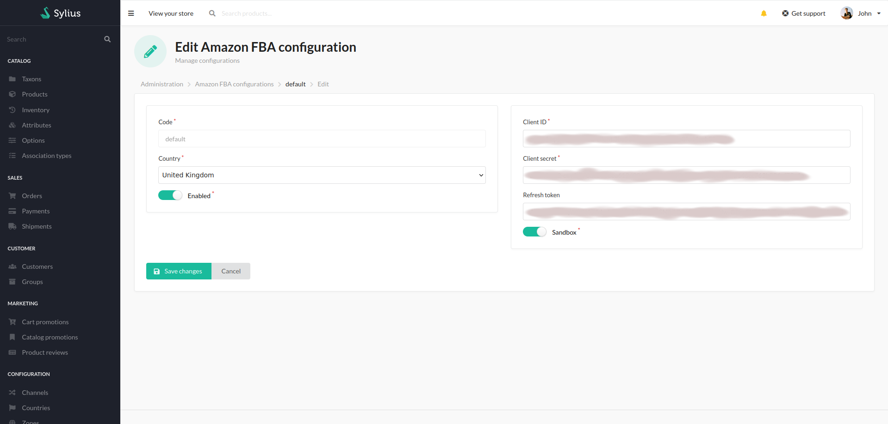
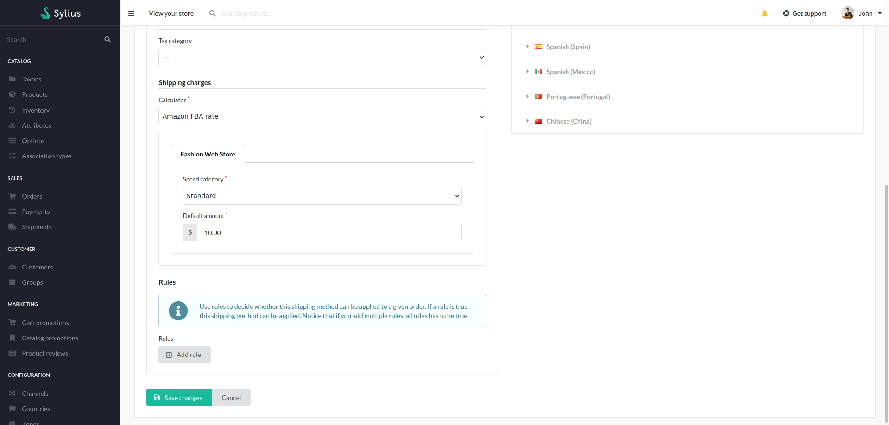

<!---
This file is part of the Odiseo Amazon FBA Plugin package, a commercial software.
Only users who have purchased a valid license and accept to the terms of the License Agreement can install
and use this program.
Copyright (c) 2018-2024 - Pablo D'amico
--->

## Setup

### Amazon FBA

Creating an Amazon FBA configuration is the first step.
Here you can set up region, environment mode, credentials, etc.

### Shipping method

In the Shipping Method section you can create the methods that connect with Amazon FBA.
Add the Amazon FBA rate calculator and set the shipping service level.

